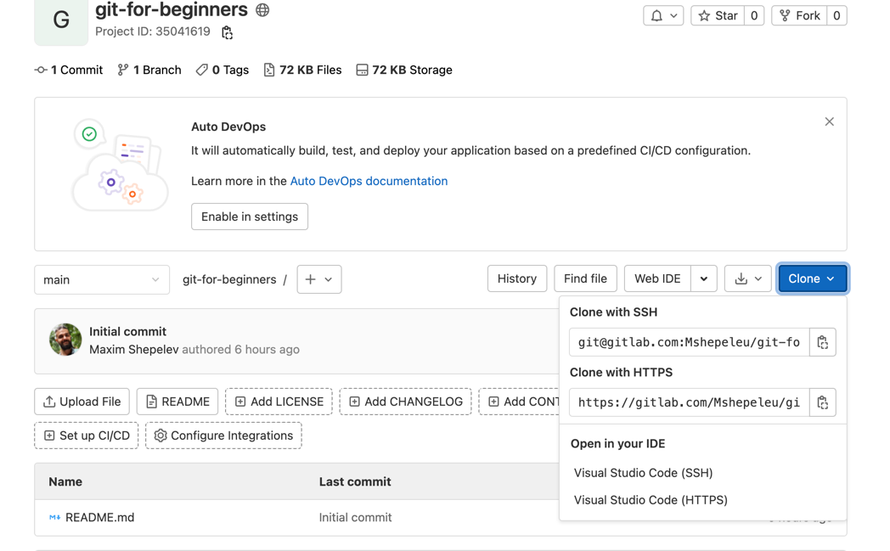
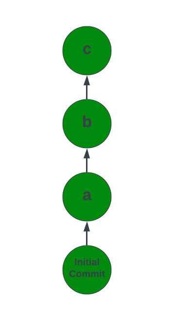
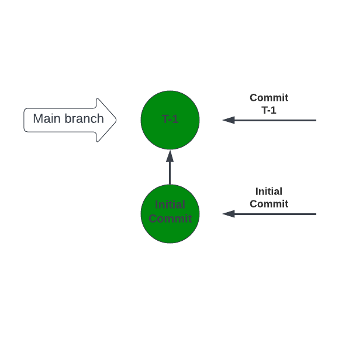
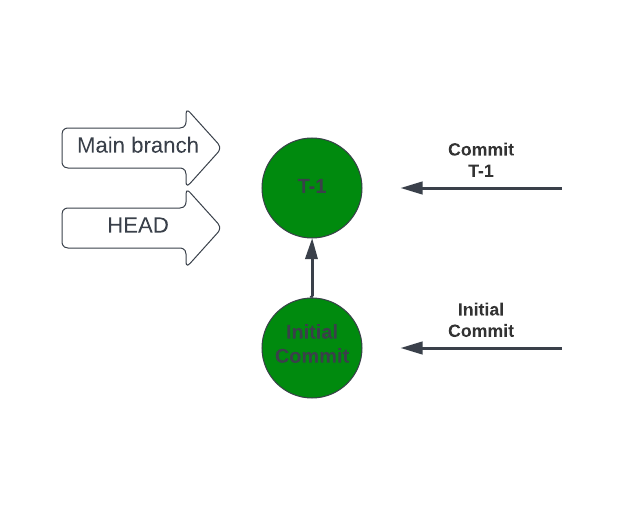
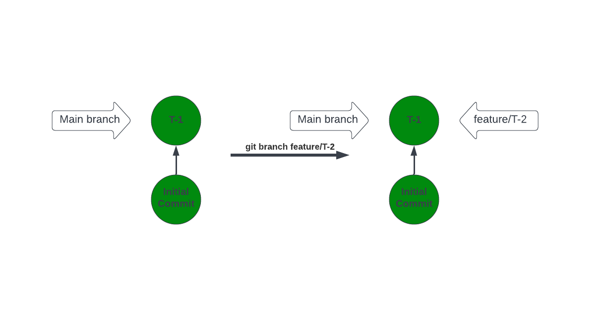
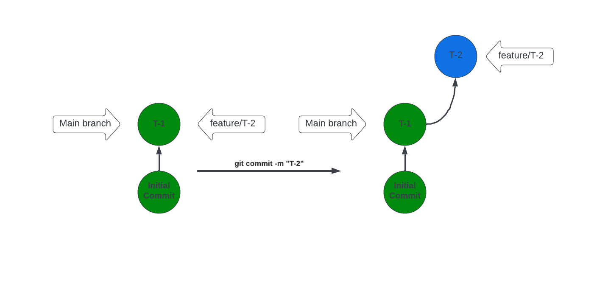
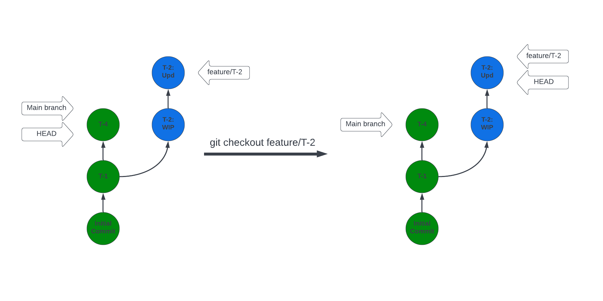
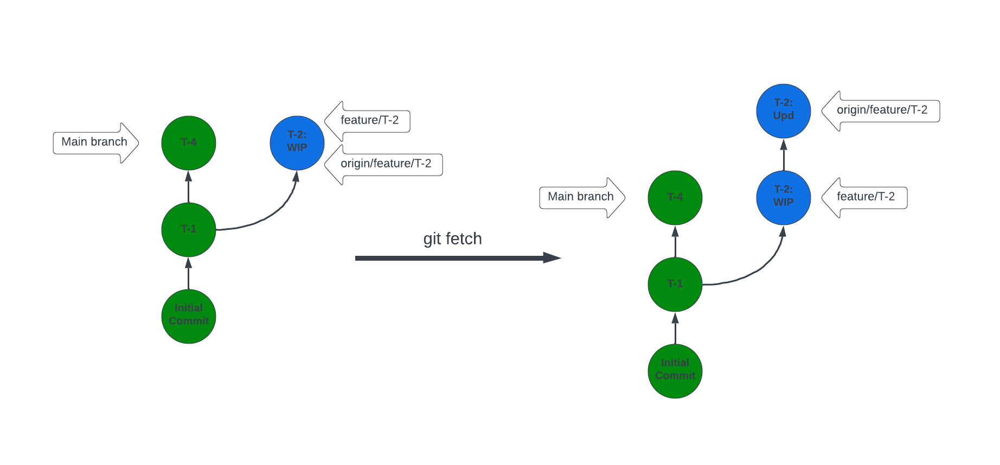
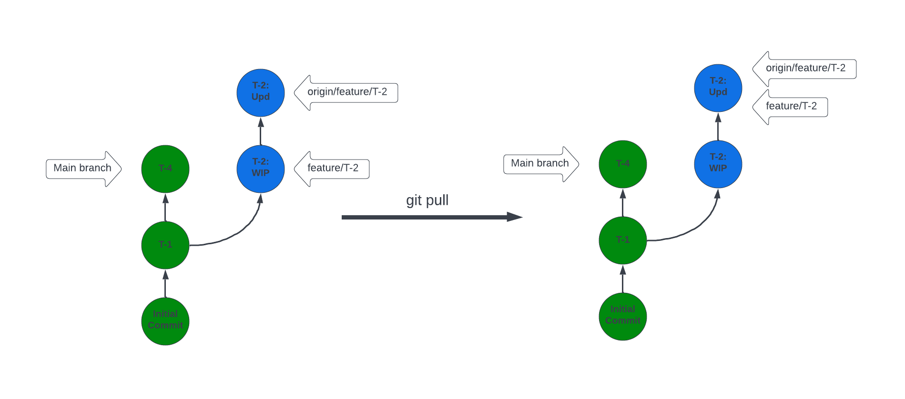
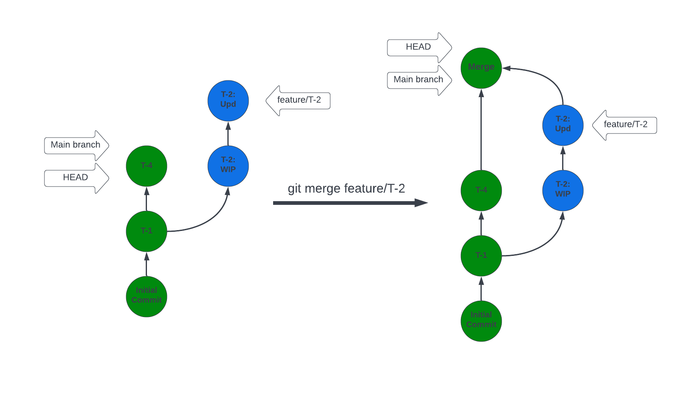

# git-for-beginners

## Overview

- Introduction and git setup
- Basic concepts
- Practice 1: cloning a repository
- Basic commands 
- Practice 2: make changes and commit
- Collaborative work: push, fetch and pull
- Practice 3: solving conflicts
- Best practices
- Practice 4: making merge requests

## Introduction

Git is a tool designed to:
- store codebase
- track changes to a codebase
- collaborate on code

### Installation

Follow instructions at: https://www.atlassian.com/git/tutorials/install-git
(or any other source, the internet is all yours to use).

Verify your installation by running:

> `git --version`

As output you should have version of installed git, for example:
> git version 2.30.1 (Apple Git-130)

### Authentication into git

There are 2 ways to authenticate(to do any operations) from your local machine into gitlab:
- http(s): authenticate your requests with login/password pair each time you access gitlab.
- SSH(preferred): Generate a pair of SSH keys, add private key to your gitlab settings. Details at: https://gitlab.com/-/profile/keys

### Command line vs UI

Here all examples will be presented as console commands, however it is much handy to use UI client. There is no conceptual difference between console or any other UI client, feel free to use what fits you best.

## Main concepts

### Repository and origin

Simplifying, a repository is a shared folder with specific usage protocol(git) applied to it. 

Usually we work with repositories hosted in external systems like `gitlab`, `github` or `bitbucket`. 
These systems "implement git" and differ in what is built on top of it: features, service, pricing, etc.

To work locally with existing repository it needs to be cloned, you can find url for cloning on repository page:

Run `git clone {url}` in any empty folder of your choice.

#### Origin

`Origin` is a shorthand name for remote repository.

 
  
What is `git clone` and local repository.

`git clone {url}` command actually does 2 different things: `git init` and `git remote add origin {url}`. 

`git init` creates a local repository, you can use it without tying it to and remote repository.

`git remote add {url}` adds remote url named "origin" to your local repository. It means that you can connect your local repository to multiple remote repositories.

### Commit

Commit is a snapshot of repository state at a moment. Consists of:
- Snapshot
- Message
- Parent
- Hash(unique identifier)

Commits:
> `Initial commit` -> `a` -> `b` -> `c` -> `d`

### Branch

Branch is a pointer to commit. When you make commit to a branch it moves "pointer" to new commit.

Default branch is `main` or `master`.

### Head

HEAD is a pointer to current state of your local repository, usually points to a branch. In some cases you might need to "point" your repository to specific commit instead of branch, in this case HEAD is called "detached".

### Practice 1: clone a repo
- verify your git installation by running `git --version`
- clone lecture repo by running: `git clone git@gitlab.com:Mshepeleu/git-for-beginners.git`
- run `cd git-for-beginners`
- run `git status`
- run `git log`

## Commands

Git commands are a way to manipulate git repository, format:

> `git {command} {argument} --{params}`

### Branch

`git branch` command is used to see information and manipulate branches.

#### Listing branches

`git branch` - list all local branches

`git branch -r` - list all remote branches

`git branch -a` - list all remote branches

#### Create branch

`git branch {name}` - creates local branch named {name}

#### Delete branch

`git branch -d {name}` - deletes local branch named {name}

Details: https://git-scm.com/docs/git-branch

### Add

`git add {file}` command used to "tell" git about changes, until added changes considered as untracked.

Details: https://git-scm.com/docs/git-add

### Commit

Create commit from tracked changes.

`git commit -m "{message}"`

New branch `feature/T-2` created:

New commit "T-2" added:

### Checkout

`git checkout {param}` moves repository state(HEAD).

Where {param} may be branch name or commit hash.

`git checkout -b {name}` - will create new branch named {name} and checkout into it.

### Practice 2: Branch and commit

- `git status`
- `git log`
- `git branch {your-name}`
- `git checkout {your name}`
- `git log`
- Create new file, make some changes
- `git add {filename}`
- `git commit`
- `git log`

## Collaborative work

### Push:

`git push` will try to push commits from current branch to corresponding remote branch.

Why "try"? Because if there is no corresponding remote branch it needs ot be created:

`git push -u origin {branchName}` - will create new branch {branchName} in remote repository linked by {originName}

`git push -u origin HEAD` - same as above, but will use current branch name

#### Practice: push your changes:

`git push -u origin HEAD`

`git log`

### Fetch:

To get actual state of git repository use "git fetch" command.

#### Practice find out about other changes:

`git branch -r`

`git fetch`

`git branch -r`

### Pull:

To update your local version of a branch with changes from remote use `git pull`.

#### Practice: pull changes

`git checkout feature/T-1`

`git log`

`git fetch`

`git status`

`git pull`

`git log`

### Merge:

`git merge` used to merge changes from another branch into current one.

`git merge {name}`

Creates "merge commit" in target(current) branch.

#### Practice:

- checkout into branch `feature/T-2`
- merge branch `feature/T-1` into it

## Conflicts

While working together collisions might happen when different people change same part of code. 
This is called "conflict", main causes of conflicts:
- push to branch that was updated
- merge with commits that change same files as target branch

## Best practices

### .gitignore

Usually each user of the repository have some local configuration files that should not be tracked in git. To achieve that behavior special file `.gitignore` is used.
It consists of paths to ignored files.

### Commits

Commit your changes regularly.

Good commit message consists of 2 parts:
- title: short summary of changes, prefixed with task id
- description(optional): detailed description of changes if it's not clear from title

Example: 

In scope of work on Jira ticket `SE-12` authorization via login and password was implemented:

Possible commit message:

> SE-12: Implement login/password authorization
> 
> &nbsp;
> 
> 
> Added login form, controllers and unit tests. Keycloak used as a user storage,
> requests are proxied  through our API.
> 
> See keycloak-service.ts for details.

Product team guidelines:

https://buynomics.atlassian.net/wiki/spaces/DEV/pages/163971073/Git+Branching+Merging+Guideline

### Config

One of benefits of git is ability to know author of the changes, set your username and email:

`git config --global user.name "{firstName} {lastName}"`

`git config --global user.email "{firstName}.{lastName}@buynomics.com"`

Notice `--global` flag, it marks that changes will be applied globally, changing config without that flag will set it to current project.

### Merge request and code review

To manage which changes, when and how will be merged "merge requests" are used.
Merge requests are created in `gitlab`. When created the following must be configured:
- source branch
- target branch
- reviewers

Usually these are requests to merge features into `main` branch. Reviewer(s) review code, leave comments and approve requests.
Once approved request may be merged.